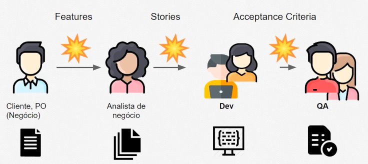

# t8s

[](https://pypi.org/project/t8s)
[](https://pypi.org/project/t8s)
[](https://pypistats.org/packages/t8s)
[](https://github.com/joao-parana/t8s/actions)
[](https://t8s.readthedocs.io/en/latest/?badge=latest)

-----

**Table of Contents**

- [Installation](#installation)
- [Testing](#testing)
- [Publishing](#publishing)
- [License](#license)

## Installation

```bash
pip install t8s
# Edit your code using t8s.ts.TimeSerie and others related classes
```

Check Linter rules using **PyRight** (https://microsoft.github.io/pyright)

```bash
pyright --level warning .
```

## Testing



Veja também [BDD](docs/behave.md)

```batch
# Para inspecionar a configuração do ambiente de testes:
hatch config show
hatch clean
hatch build
# Edit your main.py code
hatch run python3 main.py
./test-all.sh
# Usando BDD com behave (https://behave.readthedocs.io/en/latest/)
rm logs/timeseries.log
python3 -m behave --logging-level INFO --no-capture --no-capture-stderr --no-skipped features
cat logs/timeseries.log
```

## Publishing

```bash
hatch publish
```

## License

`t8s` is distributed under the terms of the [MIT](https://spdx.org/licenses/MIT.html) license.
